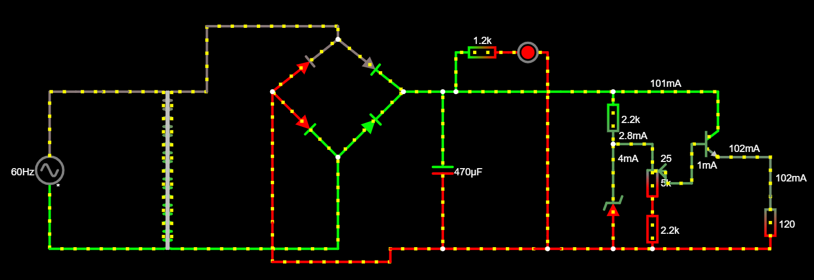

# Projeto fonte com tensão ajustavel (3V-12V)
Trabalho 1 - Fonte

O objetivo deste projeto é fazer uma fonte com uma apartir de uma tensão alternada tendo que ser ajustavel entre 3 e 12 volts, com capacidade de 100mA.

Materia: Eletronica para computação.

Professor: Eduardo do Valle Simões.

Aluno: Osni Brito de Jesus 

NUSP: 11857330

| Componentes  |  Preço(R$)  |
| ------------------- | ------------------- |
|  [Diodo 1N5404 (até 3A)](https://www.baudaeletronica.com.br/diodo-1n5404.html) |  4 x 0,36 |
|  [Capacitor 470uf x 50V](https://www.eletrogate.com/capacitor-eletrolitico-470uf-x-50v?utm_source=Site&utm_medium=GoogleMerchant&utm_campaign=GoogleMerchant&gclid=EAIaIQobChMIwLCm0bbN6gIVjA6RCh1ObAOAEAkYASABEgJvCfD_BwE)  |  0,90 |
|  [Resistor 2,2k (1/4W)](https://www.baudaeletronica.com.br/resistor-2k2-5-1-4w.html) |  2 x 0,08 |
|  [Resistor 1,2k (1/4W)](https://www.baudaeletronica.com.br/resistor-1k2-5-1-4w.html) |  0,08 |
|  [Diodo Zener 1N4743 [13V / 1W]](https://www.baudaeletronica.com.br/diodo-zener-1n4743-13v-1w.html) |  0,20 |
|  [Potenciometro Linear 5K](https://www.americanas.com.br/produto/1486223377?sellerid=16569609000116&epar=%7Bifpla:%7B_epar%7D%7D%7Bifdyn:%7B_epar%7D%7D%7Bifdbm:ds_at_ov_db_acom$%7BCAMPAIGN_ID%7D%7D&opn=YSMESP&WT.srch=1) |  6,61 |
|  [Transformador 127v-220v](https://produto.mercadolivre.com.br/MLB-989883391-transformador-trafo-1212v-200ma-bivolt-eletronica-eletrica-_JM?quantity=1#position=1&type=item&tracking_id=9abf8c61-6492-4e02-bb1d-d1a22f9b055d) |  22,99 |
|   [Transistor NPN BC337 (de até 45v 500mAh)](https://www.baudaeletronica.com.br/transistor-npn-bc337.html)   |   0,17   |
| TOTAL |  R$ 32,55  |

## Projeto no Falstad
 
 [link do circuito FALSTAD](http://tinyurl.com/ya34tdqr)
 
## Projeto no EAGLE
 
 
## Projeto do EAGLE pronto para impressão na placa
 
 
 [Explicação no youtube aqui](https://www.youtube.com/watch?v=vDUC-hhlkVI&feature=youtu.be)
